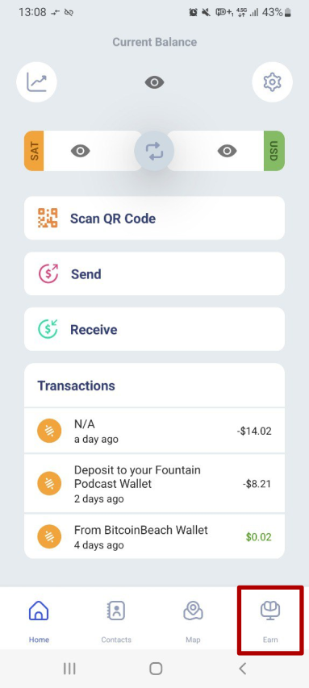

# Bitcoin Beach Wallet

In addition to basic send, receive and store functionality, the Bitcoin Beach Wallet offers a set of unique features.

**Merchant Map**: Find nearby merchants who accept payment with Lightning for their goods and services.

**Stablesats**: Hold money in a synthetic Dollar account to hedge against short term exchange rate volatility.

**Earn**: Learn about bitcoin and money in short lessons and earn sats for progressing.

The best way to learn about bitcoin is to start using it. The Bitcoin Beach Wallet aims to make it extremely easy for beginners to start using bitcoin. But when the user has made their first successful transaction, it's time to dig a little deeper into what bitcoin is and how money works. The Earn section is the best place to do this.

 .png>)

It is located on the bottom right of the app so it can be accessed easily at any time. Here, users can learn important concepts in short lessons and validate understanding of the concepts by answering quizzes.

As a bonus, each completed lesson pays out a reward in real bitcoin directly to the user's balance!

**Developing Earn**: Every day, thousands of Bitcoin Beach Wallet users around the world learn basic concepts with Earn that enhance their understanding of bitcoin a bit more. And not only do they learn, they also earn sats for doing so.

The first iteration of Earn covered four basic chapters with lessons and quizzes. In a lesson, users learn a concept. Understanding of the concept is then tested in a quiz. Upon successful completion of the quiz, a bitcoin reward is immediately credited to the user's bitcoin balance.

We would like to extend the Earn section by adding more lessons, so users can learn even more about bitcoin in a fun way that keeps users coming back to learn and earn more (about) bitcoin every day.

Which important concepts should beginners learn next? Join us in the education channel on [Galoy Mattermost ](https://chat.galoy.io/galoy/channels/education)and help us develop the next chapters that will educate the world about bitcoin, bit by bit and sat by sat. 🧡
