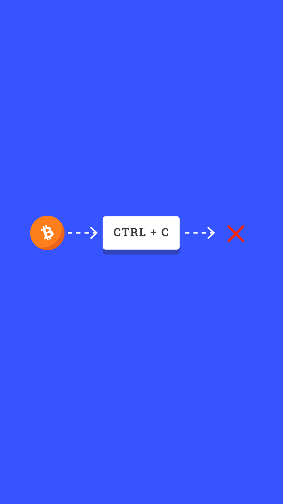

# 104.3 Lesson - NoCounterfeitMoney

**Screen:** NoCounterfeitMoney

**Headline:** Special Characteristic

**Reward:** 6

**Text:** Paper money, checks and credit card transactions can all be counterfeit, or faked.

The unique software that runs the Bitcoin network eliminates the possibility of duplicating money for counterfeit purposes.

New bitcoin can only be issued if there is agreement amongst the participants in the network. People who are voluntarily running bitcoin software on their own computers and smartphones.

This ensures that it is impossible to counterfeit, or create fake bitcoins.

=================================================================

## QUIZ

**Question:** Can people counterfeit Bitcoin?

**Answer:** No. It is impossible to counterfeit Bitcoin.

**Feedback:** counterfeit Bitcoin.

**Correct:** true

**Answer:** Yes. Although creating fake bitcoin requires very specialized computers.

**Feedback:** Incorrect. There is no way for anyone to copy or duplicate the value of a bitcoin.

**Correct:** false

**Answer:** Yes. The govrenment can print as much bitcoin as it likes.

**Feedback:** Wrong. Although the government can print unlimited dollars, it can not print bitcoin.

**Correct:** false

<figure><figcaption></figcaption></figure>

