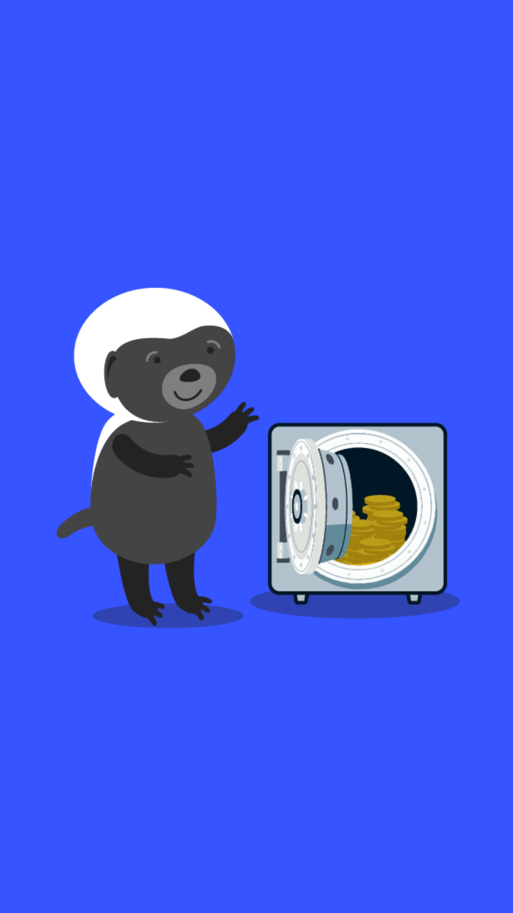

# 203.3 Lesson - storeOfValue

**Screen:** storeOfValue

**Headline:** Four Stages of Money: Store of Value

**Reward:** 2

**Text:** The store of value is the second stage of money&#x27;s evolution. When enough people want money because of its special qualities, it becomes a way to keep and save value over time, to transport hard earned wealth into the future.

As more people recognize a good as a good way to store value, the good&#x27;s value increases as more people want it for this purpose.

Eventually, the value of a store of value will stop increasing as it becomes widely held and fewer new people want it as a store of value.

=================================================================

## QUIZ

**Question:** What determines the purchasing power of a store of value?

**Answer:** The number of people who want it as a store of value

**Feedback:** Nice work! The purchasing power of a store of value is determined by the number of people who want to use it as a way to store value. As more people want to use it for this purpose, the value of the store of value increases

**Correct:** true

**Answer:** The weather

**Feedback:** Sorry, the weather is definitely a factor in many things, but it&#x27;s not quite the right answer for this question, even if some Central Bankers blame the climate for inflation. Maybe try looking at other factors that could affect the value of a store of value.

**Correct:** false

**Answer:** The color of the store of value

**Feedback:** I&#x27;m sorry to say that the color of a store of value probably doesn&#x27;t have much of an effect on its purchasing power. It&#x27;s definitely an interesting idea though! Maybe try considering other characteristics that could affect the value of a store of value.

**Correct:** false

<figure><figcaption></figcaption></figure>

