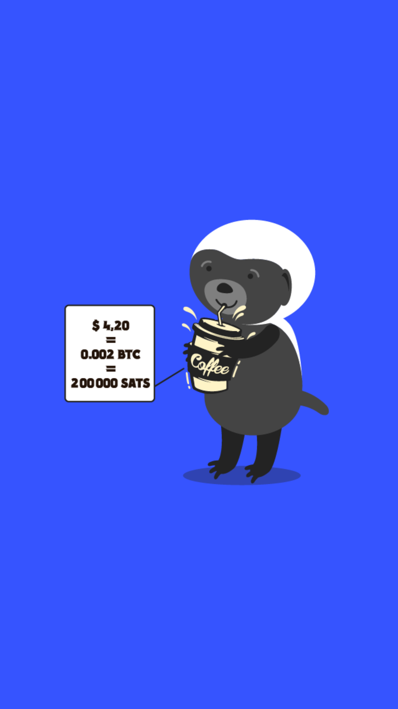

# 203.5 Lesson - unitOfAccount

**Screen:** unitOfAccount\
**Headline:** Four Stages of Money: Unit of Account\
**Reward:** 9\

**Text:** When money is commonly used for trading, goods are priced in terms of it. This means that most goods can be exchanged for money at a certain rate.&amp;#x20;

It is not accurate to say that many goods can be bought with bitcoin today. For example, while a cup of coffee might be available for purchase using bitcoin, the price listed is not the true value of bitcoin. Instead, it is the dollar price that the merchant wants, converted into bitcoin based on the current exchange rate between dollars and bitcoin.&amp;#x20;

If the value of bitcoin goes down in terms of dollars, the merchant will ask for more bitcoin to equal the same dollar amount.&amp;#x20;

Bitcoin can only be considered a unit of account (a standard way to measure the value of goods) when merchants are willing to accept it for payment without considering the exchange rate with other currencies.
\

**Question:** How can bitcoin be considered a unit of account\

**Answer:** When merchants are willing to accept it as payment without considering the exchange rate with other currencies\
**Feedback:** Congrats! For bitcoin to be considered a unit of account, it needs to be widely accepted as a form of payment without regard to its exchange rate with other currencies. This means that merchants would be willing to accept it as payment without considering the value of bitcoin in terms of other currencie\
**Correct:** true\

**Answer:** When it is used to buy ice cream\
**Feedback:** I&#x27;m sorry, but while ice cream is delicious, it&#x27;s not quite the right answer. Maybe try considering other factors that could affect the acceptance of bitcoin as a unit of account\
**Correct:** false\

**Answer:** When it is used to play games with friends\
**Feedback:** Playing games with friends is always fun, but unfortunately it&#x27;s not the correct answer. Maybe try thinking about what it would take for bitcoin to be widely accepted as a form of payment.&quot;\
**Correct:** false\

<figure><figcaption></figcaption></figure>

