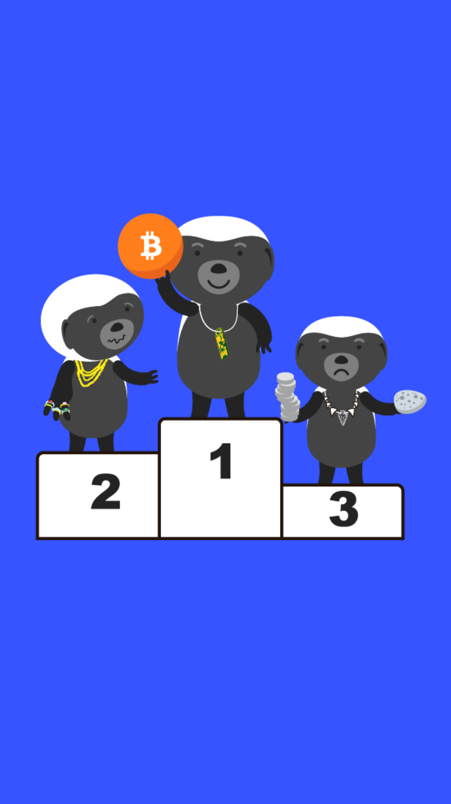

# 203.7 Lesson - monetizationStage

**Screen:** monetizationStage\
**Headline:** Bitcoin is in the stage of monetization\
**Reward:** 9\
**Illustration:** \

**Text:** Bitcoin is currently changing from the first stage of being used as money to the second stage. It may take several years for Bitcoin to be used as a way to trade goods and services, like other currencies.

The process of Bitcoin becoming more widely accepted as money is uncertain, as the same process took a long time for gold and no one alive has seen a good become money in the same way that is happening with Bitcoin. There is not a lot of experience with this process, but developments around the world are very promising and happening faster in the interconnected digital age.
\

**Question:** What is the current stage of Bitcoin&#x27;s evolution\

**Answer:** It is in the process of becoming more widely accepted as money\
**Feedback:** Bingo! You&#x27;re right on the money (pun intended) with this answer. Did you know that the process of Bitcoin becoming more widely accepted as money is similar to the process gold went through to become a widely accepted form of currency\
**Correct:** true\

**Answer:** It is currently being used as a way to trade goods and services, like other currencies.\
**Feedback:** Ha! You must have missed the part about it taking several years for Bitcoin to reach this stage. Keep reading\
**Correct:** false\

**Answer:** It has already completed the process of becoming more widely accepted as money and is now being used as a form of currency.\
**Feedback:** Sorry to break it to you, but Bitcoin is still in the process of becoming more widely accepted as money. Better luck next time!\
**Correct:** false\

<figure><figcaption></figcaption></figure>

