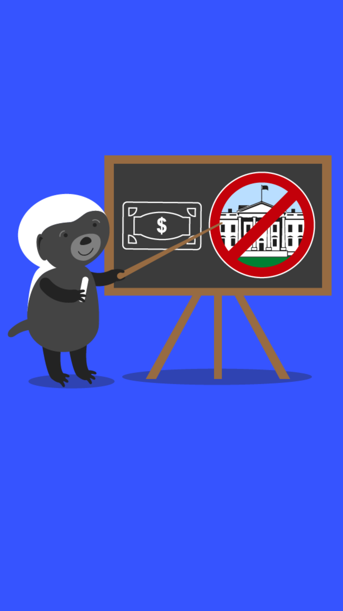

# 204.1 Lesson - notFromGovernment

**Screen:** notFromGovernment\
**Headline:** Money is not a government creation\
**Reward:** 10\

**Text:** There is a popular misconception that money is a government creation and cannot exist without government. This is false.&amp;#x20;

The history of money goes back thousands of years to times when governments did not exist, but money did.&amp;#x20;

This proves that money is emergent and simply the most tradable good in a market. It is not a government creation and certainly does not require a government to make money work.
\

**Question:** What is money\

**Answer:** Money is the most tradable good in any given market.\
**Feedback:** Correct. It&#x27;s interesting to think about how different societies throughout history have used different items as a form of currency, from seashells to cattle to gold. But ultimately, it&#x27;s the willingness of people to trade and accept an item as payment that determines its value as money\
**Correct:** true\

**Answer:** Money is a government creation.\
**Feedback:** Nope, sorry! Looks like the government isn&#x27;t as powerful as we thought they were. Better luck next time\
**Correct:** false\

**Answer:** Money is a magical substance created by fairies.\
**Feedback:** Sorry, but it looks like the tooth fairy is the only one making magic money these days. Better luck with your next answer!\
**Correct:** false\

<figure><figcaption></figcaption></figure>

