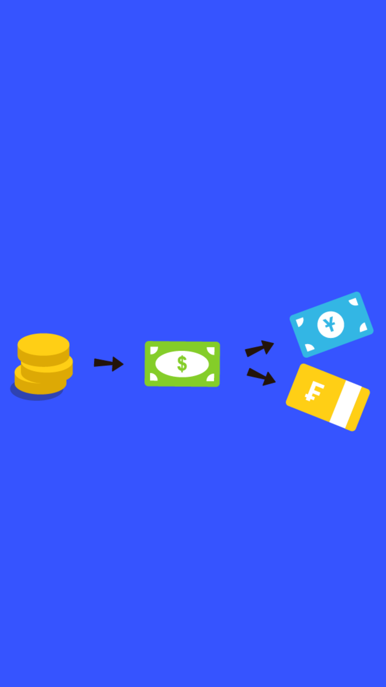

# 205.07 Lesson - brettonWoods

**Screen:** brettonWoods\
**Headline:** The Bretton Woods System\
**Illustration:**

**Text:**  After World War I and II, many countries were financially exhausted and did not have a lot of money. The United States had a lot of gold because they sold a lot of weapons and other military equipment to other countries during the wars. As a result, the United States controlled about two-thirds of the world's gold.&#x20;

In order to fix the global economy, a new system was created where countries would link their own currencies to the value of the US dollar.&#x20;

The US dollar, in turn, would be linked to the value of gold. This meant that the value of other countries' currencies would be based on the value of the US dollar, which was based on the amount of gold the United States had.

<figure><figcaption></figcaption></figure>
