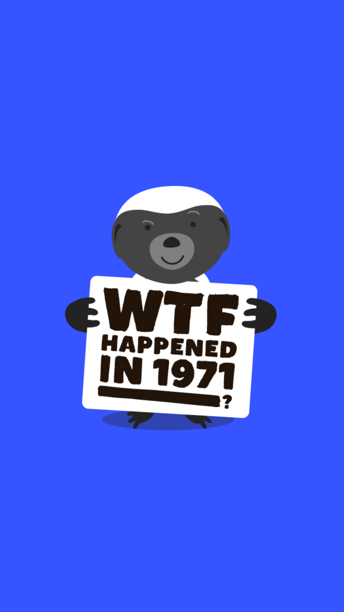

# 206.1 Lesson - nixonShock

**Screen:** nixonShock\
**Headline:** The Nixon Shock\
**Reward:** 12\
**Illustration:** \

**Text:** The Bretton Woods system was a monetary system established after World War II in order to address global economic instability and high levels of debt.&amp;#x20;

Under this system, many countries pegged their own currencies to the value of the US dollar, which was itself pegged to the value of gold at a fixed exchange rate. This meant that the value of other countries&#x27; currencies was indirectly tied to the value of gold through the US dollar.&amp;#x20;

In 1971, United States President Richard Nixon directed the US Treasury to stop allowing foreign governments to exchange their dollars for gold, a process known as &quot;convertibility.&quot;&amp;#x20;

The sudden end of convertibility of dollars for gold shocked the world and became known as the Nixon Shock, effectively ending the Bretton Woods system fixed exchange rates. It marked the beginning of a new monetary system based on floating exchange rates.
\

**Question:** What happened to the Bretton Woods system in 1971\

**Answer:** It ended and was replaced by a new monetary system based on floating exchange rates\
**Feedback:** Correct! In 1971, President Nixon directed the US Treasury Secretary to stop allowing foreign governments to exchange their dollars for gold\
**Correct:** true\

**Answer:** It became a popular TV game show\
**Feedback:** Not quite, but a game show version of the Bretton Woods system sounds like it could be entertaining\
**Correct:** false\

**Answer:** It was turned into a giant roller coaster ride\
**Feedback:** I see what you did there, but this isn&#x27;t the correct answer here. Try again!\
**Correct:** false\

<figure><figcaption></figcaption></figure>

