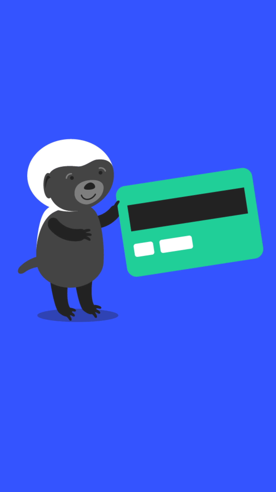

# 206.04 Lesson - plasticCredit

**Screen:** plasticCredit\
**Headline:** Plastic Credit\
**Illustration:**

**Text:** The credit card is a type of payment card that allows people to borrow money to pay for things. When people use credit cards, they are borrowing money from the credit card company to pay for things now, rather than saving up money to pay for things later.

This has gradually normalized the act of borrowing for consumption, something that impacts the time preference of users. Instead of waiting to save up the money, the invention of credit cards has made it more common for people to borrow money to buy things they want right away

Today, there are about three billion credit cards in use around the world.

<figure><figcaption></figcaption></figure>
