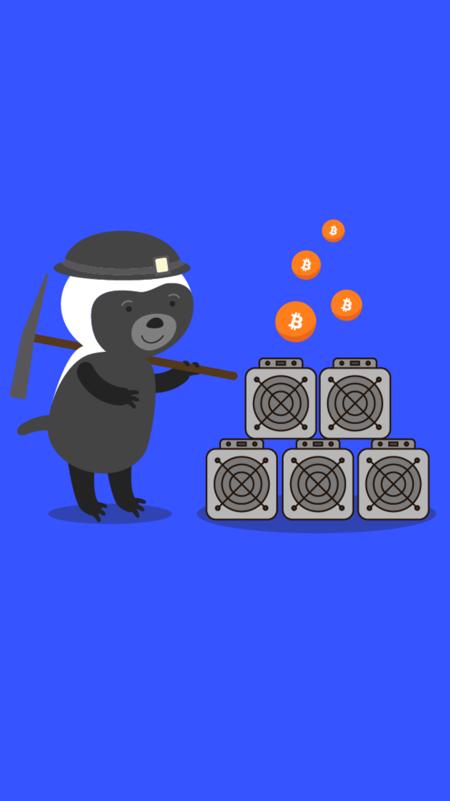

# 302.5 Lesson - mining

**Screen:** mining\
**Headline:** Mining\
**Reward:** 14\

**Text:** When a user wants to send a transaction in the bitcoin network, they need to sign the transaction with their private key to prove that they are the owner of the funds being transferred. Once the transaction is signed, it is broadcasted to the peer-to-peer network.

Mining is the process of adding transactions to the bitcoin blockchain. When a transaction is broadcasted to the network, it is picked up by miners, who verify that the transaction is valid (i.e., the user has the necessary funds and the private key used to sign the transaction corresponds to the public key associated with the funds).

Once a transaction has been verified, it is added to a block of transactions, along with a mathematical puzzle. Miners compete to solve the puzzle, and the first one to solve it gets to add the block to the blockchain and claim a reward in bitcoin. The reward is currently 6.25 bitcoins, plus any transaction fees that were included in the block.

In addition to adding transactions to the blockchain, mining also serves to secure the bitcoin network. This is because solving the puzzle requires a significant amount of computational power, and adding a block to the blockchain requires other miners to verify the solution. This makes it very difficult for any one person or group to manipulate the blockchain.
\

**Question:** What is the main purpose of mining in the bitcoin network\

**Answer:** To add transactions to the blockchain and secure the network\
**Feedback:** Correct! Miners perform work in the form of computations and compete with other miners for who can add the next block of transactions to the blockchain and earn the block reward\
**Correct:** true\

**Answer:** To make a lot of money\
**Feedback:** That&#x27;s not the main purpose of mining. **** While it&#x27;s true that miners do receive a reward in bitcoin for their efforts, they also have to pay for the electricity they use to perform computations. Try again\
**Correct:** false\

**Answer:** To amass giant amounts of computation power for AI to take over the world\
**Feedback:** Wow, that&#x27;s an ambitious goal! While it&#x27;s true that mining requires a significant amount of computational power, I&#x27;m pretty sure the main purpose is not to create an army of AI overlords. Better luck next time!\
**Correct:** false\

<figure><figcaption></figcaption></figure>

