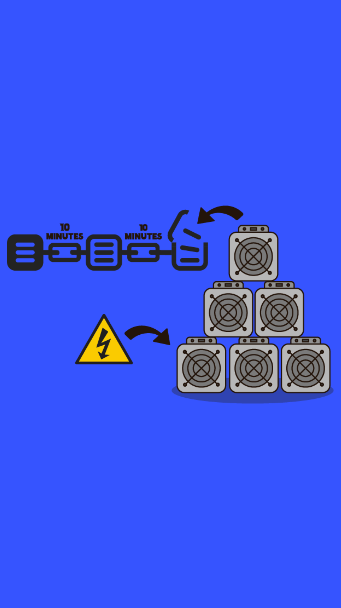

# 302.06 Lesson - proofOfWork

**Screen:** proofOfWork\
**Headline:** Proof of Work\
**Illustration:**

**Text:** Decentralized systems, by definition, do not have a single source of truth.

Satoshi's breakthrough was to build a system that allows all participants to zero in on the same truth independently. Proof of work is what allows this to happen. The point of proof of work is to create an irrefutable history. If two histories compete, the one with the most work embedded in it wins.

The chain with the most work is the truth, by definition. This is called Nakamoto consensus. This works because work requires energy. In Bitcoin, work is computation. Not any kind of computation, but computation that has no shortcut: guessing.&#x20;

In the absence of a central authority, proof of work is necessary because it ensures that there is no shortcut to adding transactions to the blockchain.&#x20;

Miners must compete to solve the puzzle through brute force computation, which is probabilistic in nature, and the proof that the work has been done becomes self-evident in the outcome of the work. This makes it very difficult for any one person or group to manipulate the transaction history.

<figure><figcaption></figcaption></figure>
