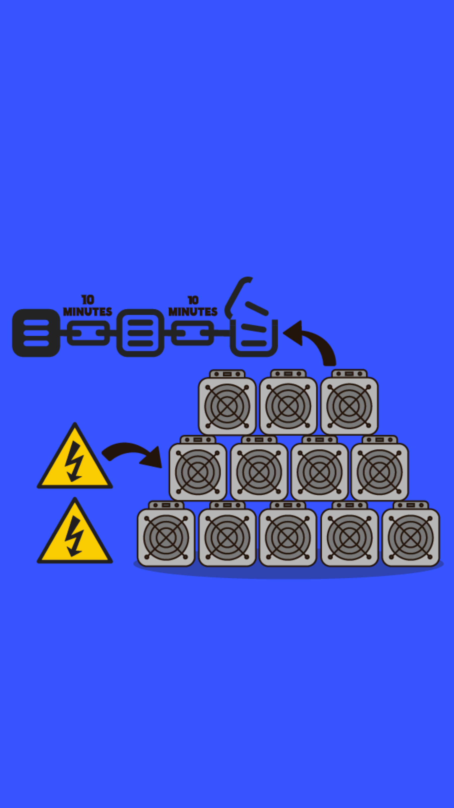

# 302.7 Lesson - difficultyAdjustment

**Screen:** difficultyAdjustment

**Headline:** Difficulty Adjustment

**Reward:** 4

**Text:** A crucial element of the Bitcoin protocol is the Difficulty Adjustment. This algorithm ensures that new blocks are found every 10 minutes on average.

When more miners join the network, the average time required to find a new block goes down. In the opposite case, when miners leave the network, it takes longer to add a new block. The Difficulty Adjustment algorithm adjusts the difficulty of the mathematical puzzle to match changes in the combined computing power of all miners. This prevents the creation of more (or less) bitcoin units than the predetermined supply schedule.

This is in stark contrast to physical mining of precious metals like gold where adding more gold miners leads to a higher supply of gold and therefore a decrease in its price. In Bitcoin however, the addition of new miners only adds more security to the network.

=================================================================

## QUIZ

**Question:** Does bitcoin emission increase when there are more miners?

**Answer:** No, the emission of new bitcoins is independent of the number or power of miners.

**Feedback:** That&#x27;s right! No matter how many miners there are, new bitcoins are issued every 10 minutes. The difficulty adjustment makes sure the issuance interval stays the same.

**Correct:** true

**Answer:** Only when the FED Commission thinks that more bitcoins are needed in the economy.

**Feedback:** Sorry, but the FED has no say over the emission of new bitcoins, and that&#x27;s a good thing! Try again.

**Correct:** false

**Answer:** Yes, when demand for bitcoin increases, miners increase the supply of bitcoins to keep prices stable.

**Feedback:** Very creative, but wrong. The bitcoin supply is not elastic and issuance follows a predetermined schedule, independent of demand or the number of miners. Try again.

**Correct:** false

<figure><figcaption></figcaption></figure>

