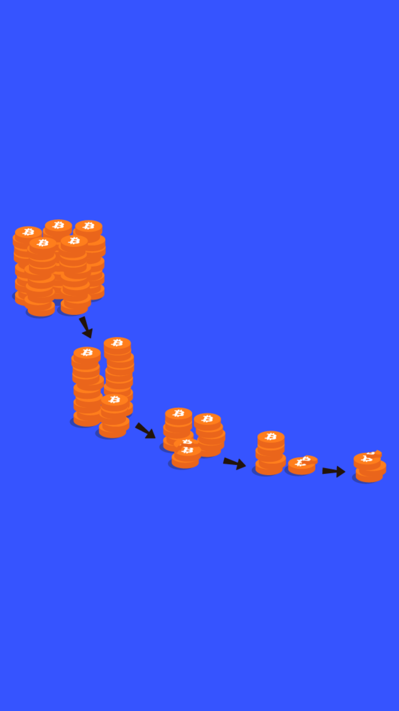

# 302.08 Lesson - halving

**Screen:** halving\
**Headline:** The Halving\
**Illustration:**

**Text:** One final element that is important to understand, is that the block reward in the bitcoin network is reduced by half every four years, or every 210,000 blocks.&#x20;

This event, known as the "halving", is programmed into the bitcoin software that all users run. When bitcoin was first launched, miners received 50 new bitcoins for each block they added to the blockchain. Currently, the block reward is 6.25 bitcoins, but it will be reduced to 3.125 bitcoins in 2024 when the next halving occurs.&#x20;

These halvings will continue to take place until the year 2140, at which point the total number of bitcoins that will have been mined will be capped at 21 million. As of 2023, around 92% of all bitcoins (\~19.3 million) have already been mined.&#x20;

Unlike fiat currencies, which can be inflationary, bitcoin is disinflationary in nature. This makes it more scarce than fiat and precious metals such as gold and silver, or anything else known in the universe.

<figure><figcaption></figcaption></figure>
