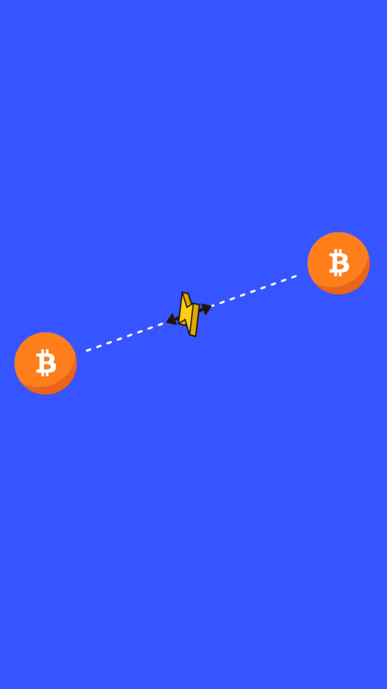

# 401.07 Lesson - paymentChannels

**Screen:** paymentChannels\
**Headline:** How does Lighning work?\
**Reward:** 15\
**Illustration:**

**Text:** The Lightning Network consists of thousands of two party payment channels.&#x20;

You may think of a Lightning channel like opening a tab at your local bar. Instead of pulling out your wallet and paying each time you order a drink, it makes sense to save time, energy and fees by tallying all your drinks together at the end of the night and making the final settlement in one payment.&#x20;

Lightning works similar. Each time a payment is made from person A to person B, bitcoin are pushed from one side of the channel to the other. Two users can pay one another back and forth as many times as they like, almost instantly and with close to no fees.

<figure><figcaption></figcaption></figure>
