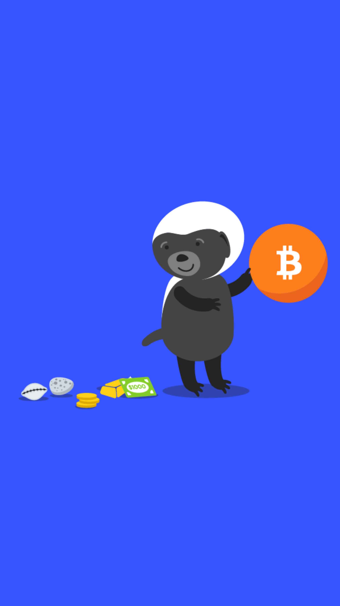

# 501.04 Lesson - willbecomeObsolete

**Screen:** willbecomeObsolete\
**Headline:** Will bitcoin become obsolete one day?\
**Illustration:**

**Text:** Bitcoin represents a unique discovery of absolute scarcity, similar to the discovery of fire, electricity, or the field of mathematics.&#x20;

It is not logical or possible to compete with bitcoin in terms of scarcity, as there is no level of scarcity higher than absolute scarcity. Criticisms of bitcoin's perceived limitations or drawbacks assume that there are no trade-offs in terms of security and incentive design, or that bitcoin's current form does not already provide significant benefits to millions of users.&#x20;

As a rapidly growing, unrestricted network with a 99.98% uptime over more than a decade, having processed trillions of dollars in value and secured by billions of dollars in hardware, it is unlikely that bitcoin will be displaced as the dominant digital monetary network at this point.&#x20;

As Michael Saylor stated, "There's never been an example of a $100B monster digital network that was vanquished once it got to that dominant position."

<figure><figcaption></figcaption></figure>
