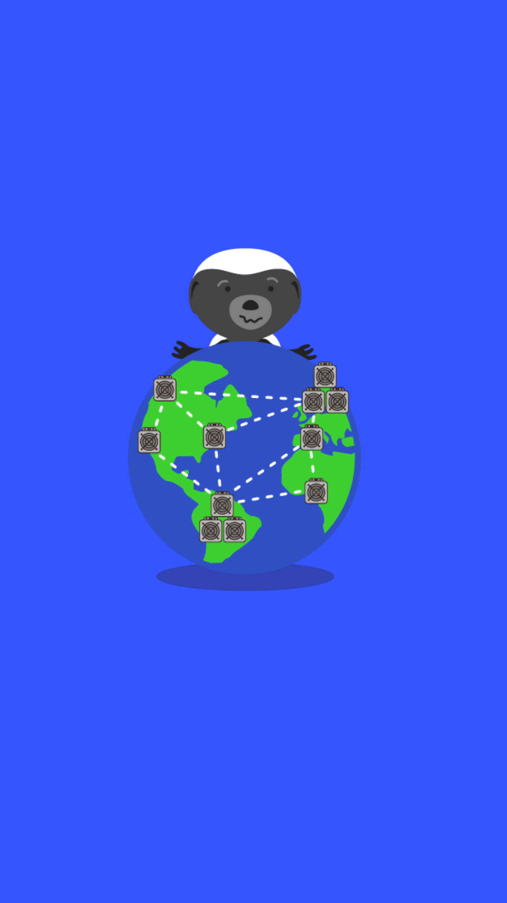

# 503.2 Lesson - centralizedMining

**Screen:** centralizedMining\
**Headline:** Bitcoin Mining Is Centralized\
**Reward:** 18\

**Text:** Some people believe that mining pools, which are groups of miners that work together to increase their chances of finding a block, could potentially disrupt the bitcoin network or censor transactions.

However, this concern stems from a lack of understanding of the incentives of miners and their role in the network. In reality, miners have a strong incentive to follow the rules of the network and maintain the integrity of the blockchain, as their own profits depend on it.

As Jimmy Song said, &quot;A majority of hashing power can&#x27;t: take coins you already possess away, change the rules of bitcoin, or hurt you without hurting themselves.&quot;
\

**Question:** Can mining pools disrupt the bitcoin network or censor transactions\

**Answer:** No, because they have a strong incentive to follow the rules of the network and maintain the integrity of the blockchain\
**Feedback:** Yep, that&#x27;s right. Did you know that the decentralized nature of the bitcoin network ensures that no single entity, including mining pools, can disrupt the network or censor transactions\
**Correct:** true\

**Answer:** Yes, because they have a majority of the hashing power\
**Feedback:** Nope, sorry! While mining pools do have a significant amount of hashing power, individual miners are extremely mobile and can trivially direct their hashrate to an honest mining pool\
**Correct:** false\

**Answer:** Yes, but only if they are acting in their own self-interest\
**Feedback:** Incorrect. While it is true that mining pools have an incentive to act in their own self-interest, this does not mean that they can disrupt the bitcoin network or censor transactions.\
**Correct:** false\

<figure><figcaption></figcaption></figure>

