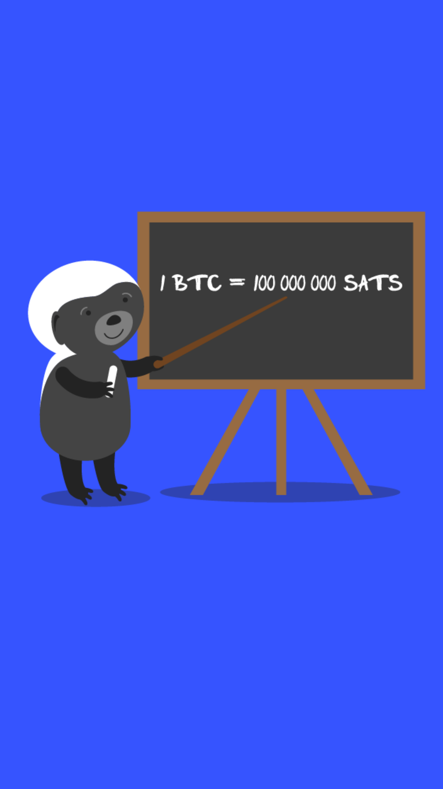

# 503.3 Lesson - tooExpensive

**Screen:** tooExpensive\
**Headline:** Bitcoin is too expensive\
**Reward:** 18\
**Illustration:** \

**Text:** One common misconception about bitcoin is that it is too expensive to purchase.

However, this belief is based on unit bias, as it is more accurate to compare the entire market capitalization of bitcoin to other assets rather than just the unit price of a single bitcoin.

It&#x27;s also worth noting that a single bitcoin can be divided into 100 million smaller units called satoshis. As the saying goes, &quot;you can buy a fraction of a bitcoin!&quot;
\

**Question:** How can you accurately compare the value of bitcoin to other assets\

**Answer:** By comparing the entire market capitalization of bitcoin to that of other asset classes\
**Feedback:** Congratulations, you&#x27;re on the right track! It&#x27;s important to consider the entire market cap of bitcoin when comparing it to other assets. Did you know that the total market cap of bitcoin reached over $1 trillion in 2021\
**Correct:** true\

**Answer:** By comparing the unit price of one bitcoin to the unit price of another asset, such as gold\
**Feedback:** Uh oh, it looks like you might have fallen for the unit bias trap! Better luck next time\
**Correct:** false\

**Answer:** By consulting a crystal ball and going with your gut feeling\
**Feedback:** Sorry, consulting a crystal ball might work for predicting the weather, but it&#x27;s not a reliable way to assess the value of bitcoin. Better luck next time!\
**Correct:** false\

<figure><figcaption></figcaption></figure>

