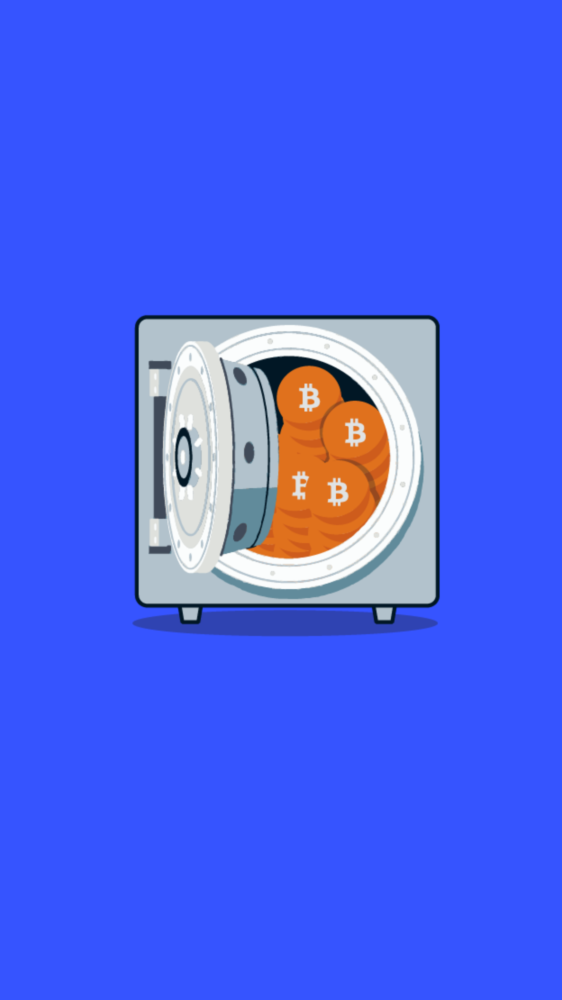

# 503.5 Lesson - willBeHoarded

**Screen:** willBeHoarded\
**Headline:** The Misconception of Bitcoin Hoarding\
**Reward:** 18\
**Illustration:** \

**Text:** There is a common belief that the fixed supply of bitcoin incentivizes hoarding, or the act of holding onto bitcoin rather than spending it in the economy.

However, this logic has a few flaws. First, saving, or the act of setting aside income for future use, is often conflated with hoarding. In fact, saving is a necessary precursor to significant investment and can be seen as a responsible financial practice.

Second, holding onto bitcoin, or any form of money, is a common way to hedge against future uncertainty and does not necessarily mean that it is not being used.

As Pierre Rochard pointed out, &quot;all bitcoin are always held by someone, payments only change who is holding it.&quot; In other words, the act of holding bitcoin is itself a use of bitcoin.
\

**Question:** Is holding bitcoin the same thing as hoarding bitcoin\

**Answer:** No, holding bitcoin is a way to hedge against future uncertainty and does not necessarily mean it is not being used\
**Feedback:** Congratulations, you&#x27;re on the right track! As Pierre Rochard pointed out, &#x27;all bitcoin are always held by someone, payments only change who is holding it.&#x27; Well done\
**Correct:** true\

**Answer:** Yes, holding bitcoin is the same thing as hoarding bitcoin\
**Feedback:** Uh oh, it looks like you might have fallen for the hoarding misconception! Holding bitcoin is a common way to hedge against future uncertainty and does not necessarily mean it is not being used\
**Correct:** false\

**Answer:** It depends on the individual&#x27;s intentions and financial goals\
**Feedback:** Sorry, but the distinction between holding and hoarding bitcoin is not dependent on an individual&#x27;s intentions and financial goals. Better luck next time!\
**Correct:** false\

<figure><figcaption></figcaption></figure>

