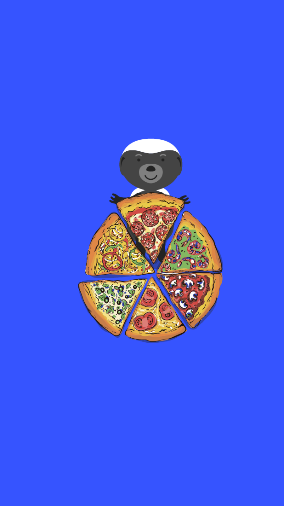

# 601.1 Lesson - scarcity

**Screen:** scarcity

**Headline:** How limited resources are allocated and competed for

**Reward:** 19

**Text:** When there are not enough resources to go around, people and organizations compete for them.&amp;#x20;

This competition is often reflected in the price of goods and services in a free market. If the demand for a particular resource increases faster than the supply, it can become scarce and more valuable.&amp;#x20;

Money is often used as a way to buy things because it is easy to trade and is valuable because it is scarce. Bitcoin is a digital form of money that has a fixed supply, which makes it rare and valuable.&amp;#x20;

The idea that there is never enough of something to go around is a basic principle of economics, but it is often ignored in political decisions.

=================================================================

## QUIZ

**Question:** What is a scarce resource

**Answer:** A resource that is limited in quantity or availability and can lead to competition for possession

**Feedback:** Remark:** Correct! Good job, you understood the concept of scarcity. Scarcity can lead to competition and can affect the value of goods and services in a free market

**Correct:** true

**Answer:** A resource that is abundant and easy to come by

**Feedback:** Wrong! Sorry to burst your bubble, but if something is easy to come by, it can&#x27;t be scarce

**Correct:** false

**Answer:** A resource that can only be obtained through time travel

**Feedback:** Wrong! Time travel is a great idea for a sci-fi movie, but it doesn&#x27;t have anything to do with scarce resources.

**Correct:** false

<figure><figcaption></figcaption></figure>

