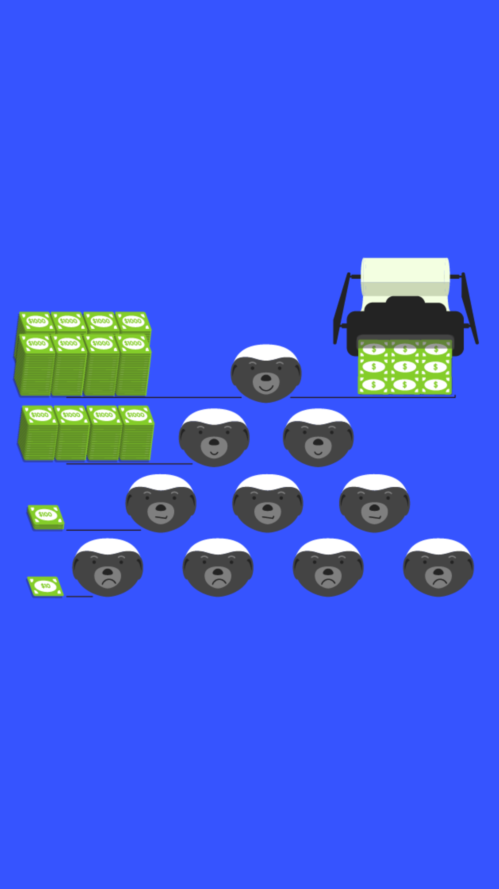

# 601.5 Lesson - cantillonEffect

**Screen:** cantillonEffect
**Headline:** The **** Cantillon Effect
**Reward:** 19

**Text:** The Cantillon Effect is a phenomenon that occurs when new money is introduced into an economy.&amp;#x20;

When new money is added, it tends to go to certain people or businesses first, and these initial recipients have an advantage over others because they get to use the new money before prices go up.&amp;#x20;

This causes the prices of some goods and services to increase more than others, which means that the people who get the new money first benefit while those who get it later are disadvantaged.&amp;#x20;

This effect was first described by economist Richard Cantillon in the context of commodity money, such as gold and silver, but it is even more relevant today in the age of fiat money.

When a government or central bank creates a lot of new fiat money, it can lead to increased prices and uneven distribution of wealth, as some people and businesses are able to access credit more easily and benefit from rising asset prices.

=================================================================

## QUIZ

**Question:** What is the Cantillon Effect

**Answer:** A phenomenon that occurs when new money is introduced into an economy, causing some prices to increase more than others and leading to an uneven distribution of wealth.
**Feedback:** Congratulations, you are correct! The Cantillon Effect is indeed a process that can influence the distribution of wealth in an economy. Good job
**Correct:** true

**Answer:** A mysterious force that causes people to turn into cantaloupes whenever they eat too much fruit.
**Feedback:** Sorry, but the Cantillon Effect doesn&#x27;t have anything to do with fruit transformation. Better luck next time
**Correct:** false

**Answer:** A dance move that involves spinning around in circles while holding a bunch of cantaloupes.
**Feedback:** Sorry, but the Cantillon Effect is not a dance move, no matter how much you love cantaloupes. Better luck next time!
**Correct:** false

<figure><figcaption></figcaption></figure>

