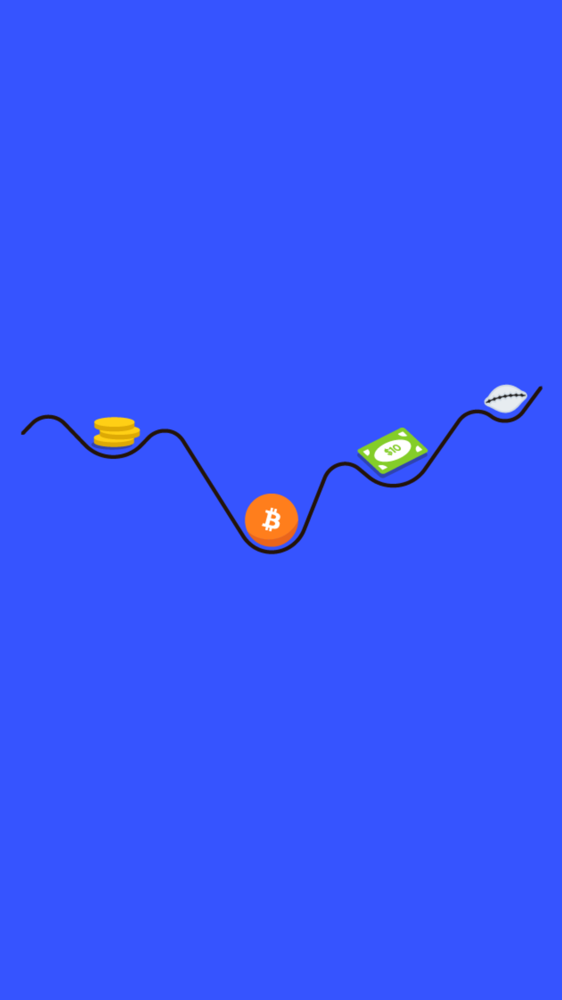

# 601.6 Lesson - schellingPoint

**Screen:** schellingPoint\
**Headline:** Schelling Point\
**Reward:** 19\
**Illustration:** \

**Text:** A Schelling point is a solution that people tend to choose by default, without communicating with each other.&amp;#x20;

This can happen in multiplayer cooperative games, where you have to anticipate the choices of others. If you make the wrong choice, you might face consequences or miss out on benefits.&amp;#x20;

Communication works the same way - it&#x27;s like a multiplayer cooperative game played with others in the same network. We use standardized protocols (like email, spoken language, or money) to communicate efficiently with as many people as possible, with as little friction as possible. This can lead to increased trade, knowledge exchange, and innovation.

In the digital world, people tend to choose the same option (the Schelling point) when exchanging value. This is because they expect that others will also choose it.&amp;#x20;

The option that becomes the Schelling point is the one that communicates price signals most accurately, allowing market participants to coordinate with each other.&amp;#x20;

Bitcoin is a protocol for exchanging value that has several advantages over traditional currencies (called &quot;fiat&quot;). For example, it has a fixed supply and its value has generally increased over time, while fiat currencies often lose value. Additionally, the bitcoin network is permissionless, global, and indestructible. All of these factors make bitcoin a natural Schelling point for money.
\

**Question:** What is a Schelling point\

**Answer:** A solution that people tend to choose by default in the absence of communication\
**Feedback:** You got it right. Did you know that a Schelling point can occur in multiplayer cooperative games and communication networks, and can be facilitated by standardized protocols like money\
**Correct:** true\

**Answer:** A type of point system used in online multiplayer games\
**Feedback:** Wrong! But at least you&#x27;re thinking about points. Maybe try again and focus on communication this time\
**Correct:** false\

**Answer:** A point on the earth&#x27;s surface where all the planet&#x27;s magnetic forces are balanced\
**Feedback:** Ha! You&#x27;re off by a whole planet. Maybe try again and focus on the concept of default choices in the absence of communication.\
**Correct:** false\

<figure><figcaption></figcaption></figure>

