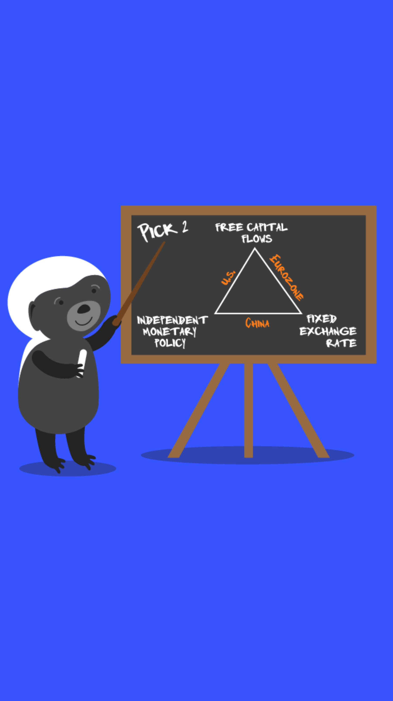

# 602.3 Lesson - impossibleTrinity

**Screen:** impossibleTrinity\
**Headline:** The Impossible Trinity\
**Reward:** 20\

**Text:** The Impossible Trinity, also known as the Mundell-Fleming Trilemma, is a concept that explains the trade-offs involved in setting international monetary policy for a sovereign nation.&amp;#x20;

It says that a country can only choose two of the following three options: fixed exchange rates, free capital flows, and independent monetary policy.&amp;#x20;

  These three options cannot be pursued at the same time. This is because a country&#x27;s capital flows, or the movement of money in and out of the country, can be influenced by the value of its currency and its monetary policy, which sets the rules for how much money is in circulation.&amp;#x20;

  As capital becomes more mobile and can move freely across borders, it is harder for a country to control and direct its capital flows. The rise of bitcoin, a digital currency that is borderless and immune to changes in value, may further challenge a country&#x27;s ability to set monetary policy.
\

**Question:** How does the existence of Bitcoin affect the Mundell-Fleming-Trilemma?&amp;#x20\

**Answer:** As perfectly mobile capital, Bitcoin alters the logic of sovereign nations to direct international monetary policy by making capital controls impossible to enforce.\
**Feedback:** enforce.\
**Correct:** true\

**Answer:** Due to its fixed supply, the existence of Bitcoin makes it easier for sovereign nations to set fixed exchange rates.\
**Feedback:** The 21 million cap is indeed quite fascinating, but the existence of Bitcoin actually makes it more difficult for nations to set fixed exchange rates. Try again\
**Correct:** false\

**Answer:** Governments will restrict discussion of the Mundell-Fleming Trilemma because speech is easier to censor than cross-border payments.\
**Feedback:** While that&#x27;s entirely possible of course, that&#x27;s not the most likeliest outcome here. Try again!\
**Correct:** false\

<figure><figcaption></figcaption></figure>

