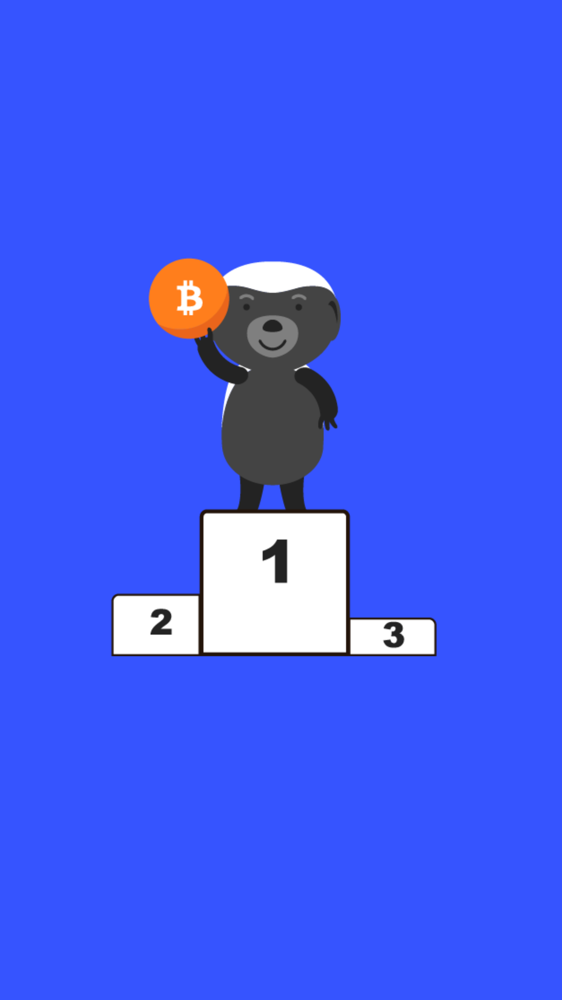

# 602.06 Lesson - winnerTakeAll

**Screen:** winnerTakeAll\
**Headline:** Winner-Take-All Effects\
**Illustration:**

**Text:** The concept of winner-take-all effects is when only one product or service is the best and everyone wants to use it. This can happen in markets where a small advantage can lead to getting all of the business.&#x20;

Money is a network like this, where only one type of money is used in a certain area because it is the most useful and has the most options for trading with other people. This happens because people want to use the money that will give them the most options and be the most useful in a lot of different situations.&#x20;

Money is also a good way to store value over a long time. When it comes to monetary systems, people usually agree on using one type of money because it is the most liquid, or easiest to use, and it is the best way to store value.

<figure><figcaption></figcaption></figure>
