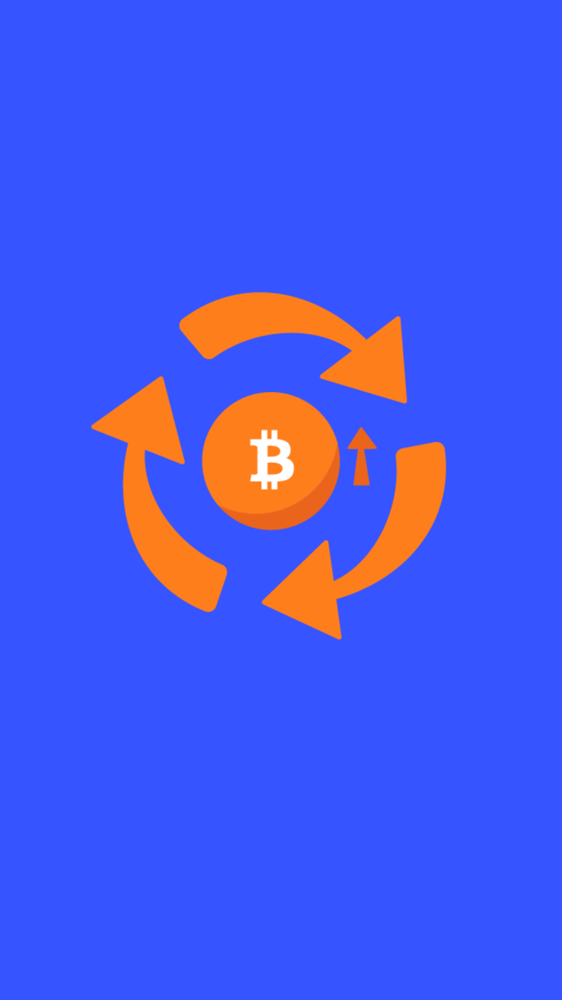

# 603.02 Lesson - veblenGood

**Screen:** veblenGood\
**Headline:** Veblen Good\
**Illustration:**

**Text:** Veblen goods are things that people want more of when the price goes up. Normal goods are things that people usually want more of when they have more money to spend.&#x20;

Veblen goods are unusual because people want them more when they cost more. These are often luxury goods that are hard to get or that are made in limited quantities. This is done to make them seem special or rare.&#x20;

Some people might want to buy bitcoin because it is a status symbol, but the main reason people will probably want to buy it is because there is a limited amount of it.&#x20;

When more people want to buy bitcoin, the price goes up and it becomes easier to use. When it is easy to use, more people want to use it. This creates a cycle where the demand for bitcoin increases, the price goes up, and it becomes easier to use.

<figure><figcaption></figcaption></figure>
