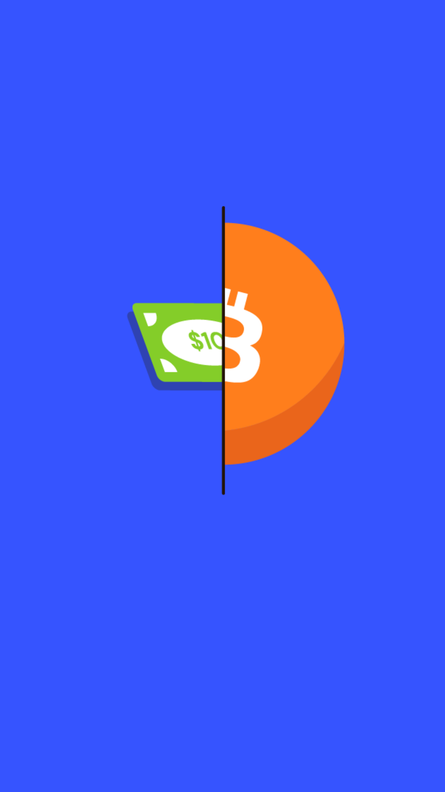

# 603.04 Lesson - asymmetricPayoff

**Screen:** asymmetricPayoff\
**Headline:** Asymmetric Payoff\
**Reward:** 21\
**Illustration:**

**Text:** When we make decisions about investing our money, we try to predict what might happen and how much money we could make or lose. Sometimes, the amount of money we can make or lose is not equal.&#x20;

For example, if we invest in something that has a big chance of making us a lot of money, but only a small chance of losing a little bit of money, we might call this an "asymmetric payoff." This means that the potential upside (how much we can make) is much bigger than the potential downside (how much we can lose).&#x20;

One example of this is bitcoin. Bitcoin's potential outcomes are similar to an option, meaning it either succeeds or fails. If it experiences a catastrophic event, the risk of losing money is minimized.&#x20;

However, the potential upside is much greater, as bitcoin's total addressable market has the potential to be a primary global store of wealth.&#x20;

Asymmetry in payoffs, or uneven potential outcomes, only occurs when there is uneven understanding or information about an investment. If everyone fully understood bitcoin, it would already be widely used as a form of currency.&#x20;

Currently, not everyone is aware of bitcoin's potential as a superior monetary option, so the potential for it to increase in value depends on the demand for it increasing without a corresponding increase in the supply.

<figure><figcaption></figcaption></figure>
